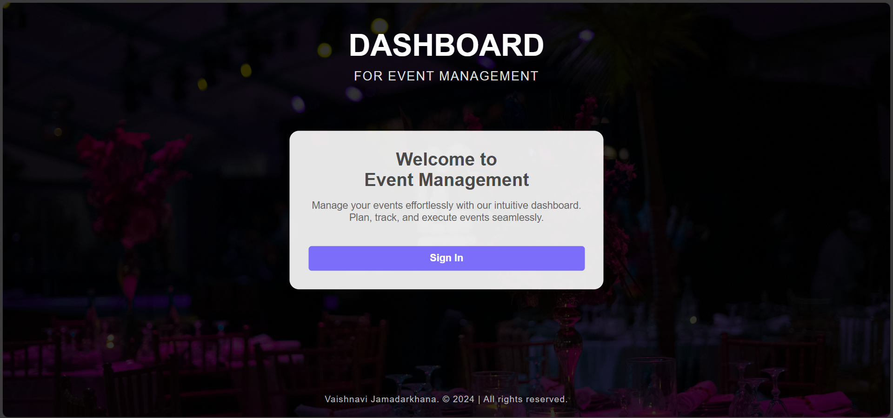

# Event Management Dashboard

 

## Description

The Event Management Dashboard is a web application designed to help users manage events, attendees and tracks the events efficiently. Users can view event statistics, track event completion progress, and manage attendee information. The application provides a user-friendly interface for managing events and attendees, making it easier to organize and oversee various events.

## Tech Stack

- **Frontend**:
  - HTML
  - CSS
  - JavaScript
  - Font Awesome (for icons)
- **Backend**:
  - Node.js (Express.js)
- **Authentication**:
  - JSON Web Tokens (JWT) for user authentication

## Features

- User authentication and authorization
- Dashboard displaying event statistics
- Event completion progress indicator
- Attendee management functionality
- Responsive design for mobile and desktop

## How to Run the Application

### Prerequisites

- Node.js installed on your machine
- A code editor (e.g., Visual Studio Code)

### Steps to Run the Application

1. **Clone the Repository**

   ```bash
   git clone https://github.com/Vaishnavi8507/WebKnot

   ```

2. **Install Dependencies**
   Navigate to the backend directory (if applicable) and install the required packages:

   ```bash
   cd backend
   npm install
   ```

3. **Set Up Environment Variables**
   Create a `.env` file in the backend directory and add the necessary environment variables, such as:

   ```
   JWT_SECRET=your_jwt_secret
   ```

4. **Run the Backend Server**
   Start the backend server:

   ```bash
   node server.js
   ```

5. **Run the Frontend**
   Open the `index.html` file in your browser or set up a local server (e.g., using Live Server extension in VS Code).

6. **Access the Application**
   Open your browser and navigate to `http://localhost:3000` (or the port you specified) to access the application.

## Contributing

Contributions are welcome! Please feel free to submit a pull request or open an issue for any suggestions or improvements.


